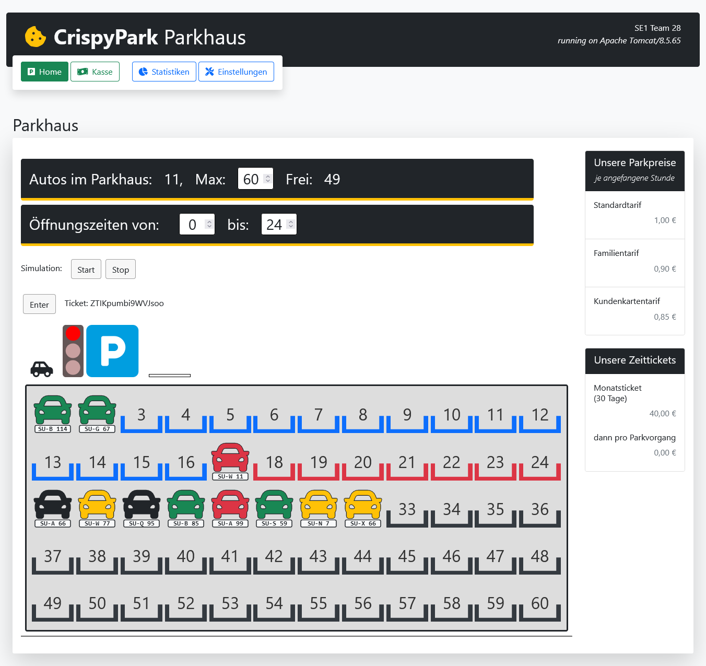
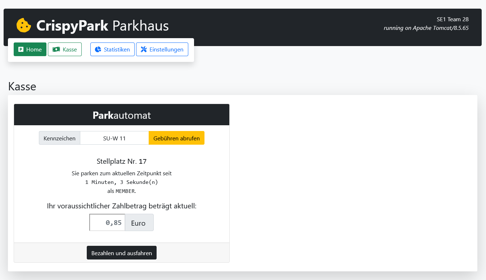
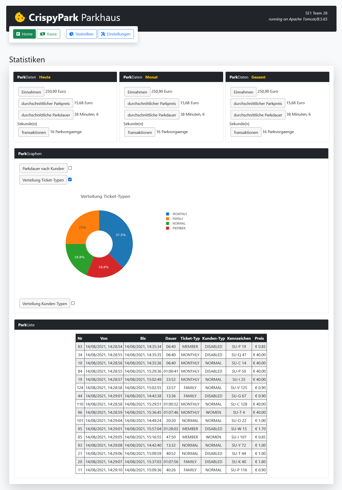

# Semesterprojekt Parkhaus-Simulation   _SE1 Team 28 "Kekse"_

## Description
Digital car park with given JS module, Jakata Servlets and JSP

### Course Objectives:
 - Agile programming with User Stories, Scrum and Kanban Board
 - Test-Driven Development (TDD)
 - Collaboration & Versioning via Git (local GitLab)
 - Basic CI/CD Pipelining (Jenkins, Apache Tomcat, SonarQube)
 - Functional Programming
 - Design principles (SOLID/DRY)
 - Design patterns

(Commit history and various files removed due to privacy reasons.)

---
## Hausarbeit
[**Projektbeschreibung**](docs/projektbeschreibung.md) ([PDF](docs/projektbeschreibung.pdf))  
**Eigenleistungen** [removed]

## Dokumente

### Projektplanung
[User Stories & MVP](docs/userstories.md)  
Kanban Board // Milestones [removed]  
[Glossar](docs/glossar.md)

### UML Digramme
[UML Use Case-Diagramm](docs/uml/crispypark-use-case.puml) ([PNG](docs/uml/crispypark-use-case.png))  
[Robustheitsdiagramm](docs/uml/crispypark-robustheit.puml) ([PNG](docs/uml/crispypark-robustheit.png))  
[UML Klassendiagramme](docs/uml/crispypark-class.puml) ([PNG](docs/uml/crispypark-class.png))  
[UML Sequenzdiagramme](docs/uml/crispypark-sequence.puml) ([PNG](docs/uml/crispypark-sequence.png))  
[UML Aktivitätsdiagramme](docs/uml/crispypark-activity.puml) ([PNG](docs/uml/crispypark-activity.png))  
[UML Verteilungsdiagramm](docs/uml/crispypark-deployment.puml) ([PNG](docs/uml/crispypark-deployment.png))  

### eingesetzte Pattern
| Pattern           | Verwendung    |
|-------------------|---------------
| Template Method   | StatsTemplate (StatsAll, StatsDay, StatsMonth, StatsYear)  &rightarrow; Statistikmethoden mit Filterung nach Zeitraum|
| Factory Method _"light"_  | Ticket.create()  &rightarrow; Factory für automatische Instanziierung eines SimpleTickets oder TimeTickets |

### Projektergebnisse
[Iterationsbericht](docs/iterationsbericht.md)  
Summarisches Projektprotokoll [removed]  
Retrospektive [removed]

---
## Ressourcen & Lizenzen
Based on [mkaul/se1-starter-repo](https://github.com/mkaul/se1-starter-repo)
- [ccm Parkhaus v10](https://github.com/ccmjs/mkaul-components/tree/master/parkhaus) (c) 2021 Manfred Kaul | MIT License
- [Bootstrap 5](https://github.com/twbs/bootstrap) (c) 2021 Twitter, Inc. | MIT License
- [Font Awesome Free 5.15.3](https://github.com/FortAwesome/Font-Awesome) (c) FontAwesome | Icons: CC BY 4.0, Fonts: SIL OFL 1.1, Code: MIT License

---

## Screenshots

### Kasse

### Statistiken
(Verwendung von ccm.Parkhaus)

### Einstellungen

